# 📘 Syllabus & Subject Selection Chatbot

An intelligent chatbot that assists students with **syllabus guidance and subject selection**.  
This bot integrates with **Google Drive**, **Pinecone**, **OpenAI**, and **Telegram** using an **n8n automation pipeline**.

## 🚀 Features
- 📂 Fetches syllabus documents and curriculum guidelines from **Google Drive**
- 🔍 Converts documents into embeddings using **OpenAI**
- 📊 Stores and searches embeddings efficiently with **Pinecone Vector DB**
- 🤖 Uses **OpenAI Chat Model** to provide personalized subject recommendations
- 🔗 Automated workflows managed via **n8n**
- 💬 Integrated with **Telegram Bot** for student interaction

## 🛠️ Tech Stack
- **n8n** — Workflow automation
- **OpenAI** — Embeddings & chat-based responses
- **Pinecone** — Vector DB for semantic search
- **Telegram Bot API** — Messaging and interaction
- **Google Drive API** — Curriculum storage and retrieval

## ⚙️ Architecture Flow

### 🔹 Workflow Diagram (Mermaid)

```mermaid
flowchart TD
    A[📂 Google Drive API] -->|Fetch Curriculum Docs| B[n8n Workflow]
    B -->|Convert to Embeddings| C[🔎 OpenAI Embeddings]
    C -->|Store & Search| D[📊 Pinecone Vector DB]
    D -->|Retrieve Context| E[🤖 OpenAI Chat Model]
    E -->|Answer Generated| F[💬 Telegram Bot]
```


### 🔹 ASCII Flow
```
[Google Drive Docs] --> [n8n Workflow] --> [OpenAI Embeddings] --> [Pinecone Vector DB]
                                                                    |
                                                                    v
                                                         [OpenAI Chat Model] --> [Telegram Bot]
```

## 📦 Setup Instructions

### 1) Clone Repository
```bash
git clone https://github.com/anuradha2504/Syllabus-advisory-chatbot-N8N
cd syllabus-selection-chatbot
```

### 2) Environment Variables
Create a `.env` file in the project root:
```
OPENAI_API_KEY=your_openai_key
OPENAI_EMBEDDING_MODEL=text-embedding-3-small
PINECONE_API_KEY=your_pinecone_key
PINECONE_ENVIRONMENT=your_pinecone_env
PINECONE_INDEX=syllabus-selection-chatbot
GOOGLE_DRIVE_API_KEY=your_gdrive_key
TELEGRAM_BOT_TOKEN=your_telegram_bot_token
```

### 3) Setup n8n
1. Install n8n (Docker, desktop, or self-hosted).
2. Import the workflow JSON: `workflows/syllabus_selection_chatbot.json`.
3. Configure credentials for **Google Drive**, **Pinecone**, **OpenAI**, and **Telegram**.

### 4) Deploy Pinecone Index
- Create index (e.g., `syllabus-selection-chatbot`).
- Dimension = `1536` (for `text-embedding-3-small`).

### 5) Run the Bot
```bash
n8n start
```
Now students can interact with the **Telegram bot** to get subject selection help and syllabus-related answers.

## 📌 Example Usage
- **Student (Telegram):** “What is the Marks Split for math?” 
- **Bot:** Searches embeddings in Pinecone → Finds relevant syllabus docs → Suggests recommended subjects.

- **Student (Telegram):** “The different branches mentioned in the syllabus overview are” 
- **Bot:** 1. English:
   - Reading Comprehension
   - Grammar
   - Writing Skills
   - Literature

2. Social Studies:
   - History: Ancient Civilizations
   - Geography: Physical Features
   - Civics: Democratic Government
   - Economics: Resources

3. Computer Science:
   - Basics of Computers
   - Coding Concepts
   - Data Handling
   - Cyber Safety

4. Mathematics:
   - Number Systems
   - Algebra
   - Geometry
   - Mensuration
   - Statistics and Probability

5. Science:
   - Matter and Its Nature
   - Motion and Force
   - Cell and Microorganisms
   - Light and Sound
   - Environment and Health.

- **Student (Telegram):** “what are topics in physics?” 
- **Bot:** 1. The topics in physics include:
- Mechanics: Laws of motion, Gravitation
- Thermodynamics: Heat, Work, Energy
- Optics: Ray and Wave Optics
- Electrodynamics: Current, Magnetism
- Modern Physics: Atoms, Nuclei, Dual Nature

**Student (Telegram):** “i what is cutoff for maths?” 
- **Bot:** The cutoff for mathematics for the year 2024 is 82%. The syllabus breakdown for mathematics includes:
- Calculus: Limits, Derivatives, Integrals (Weightage: 30%)
- Algebra: Matrices, Determinants, Complex Numbers (Weightage: 25%)
- Geometry: Coordinate, 3D, and Vector Geometry (Weightage: 20%)
- Probability: Probability Distributions, Statistics (Weightage: 15%)
- Logic & Sets: Logic, Venn Diagrams, Sets (Weightage: 10%)

## 🧩 How It Works (Step-by-Step)
1. **Google Drive** stores syllabus PDFs, subject guides, and curriculum documents.
2. **n8n** fetches documents and processes text content.
3. **OpenAI Embeddings** convert text into semantic vectors.
4. **Pinecone** stores vectors and performs similarity search.
5. **OpenAI Chat Model** generates personalized student guidance.
6. **Telegram Bot** delivers syllabus and subject advice to students.

## 🛠️ Troubleshooting
- **No syllabus returned:** Ensure documents are properly uploaded in Google Drive and processed in n8n.
- **Bot not responding:** Verify Telegram bot token inside n8n.
- **Dimension mismatch error:** Ensure Pinecone index dimension matches embedding model size.
- **Docs outdated:** Re-run ingestion workflow whenever new syllabus/subjects are added.

## 🔮 Future Enhancements
- 🎯 Personalized subject recommendation engine based on student goals
- 🌍 Multi-language support
- 📊 Dashboard for educators to monitor queries
- 📅 Integration with exam schedule APIs

## 👨‍💻 Author
Built by **Anuradha Kumari** using automation, AI, and educational data pipelines.
